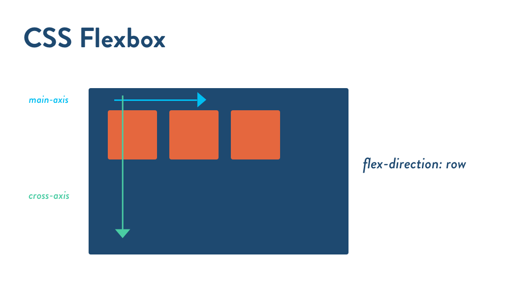

# Responsive Design

* Flexible grid-based layout
* Media queries (CSS3)
* Images that resize

## Flexbox

* Flex-containers (row) and flex-items (cells).
* Excels at vertical centering and equal heights.
* Very easy to reorder boxes.
* Major disadvantages:
  * Wasn't designed to be locked down for layouts, works in 1 dimension only.
  * Browser support and syntax is challenging.

### Browser Support

* IE 11, Edge+ (IE 10 supports with `ms` prefix syntax)
* Safari 7.1/8, iOS Safari 7/8 requires webkit prefix
* Others support current syntax

### Key Properties

* `display: flex`
* `flex-flow: row wrap`
  * `flex-direction: row`
  * `flex-wrap: wrap`
* `justify-content`
* `align-items`
* `flex-basis`: try to achieve a given width with the space available. Distribution of extra space is controlled by `flex-grow` and `flex-shrink`, how fast box expands/contracts.
* `flex: <grow> <shrink> <basis>`
* `order`

We could do different media queries like this:

`.col-1` includes:

* `flex: 0 0 24%; /* dekstop */`
* `flex: 0 0 48%; /* tablet */`
* `flex: 0 0 98%; /* phone* */`

### Flexbox as Grid System

* [Flexbox Grid](http://flexboxgrid.com)
* Media queries are for 480px 768px and above, we write css for mobile first.
